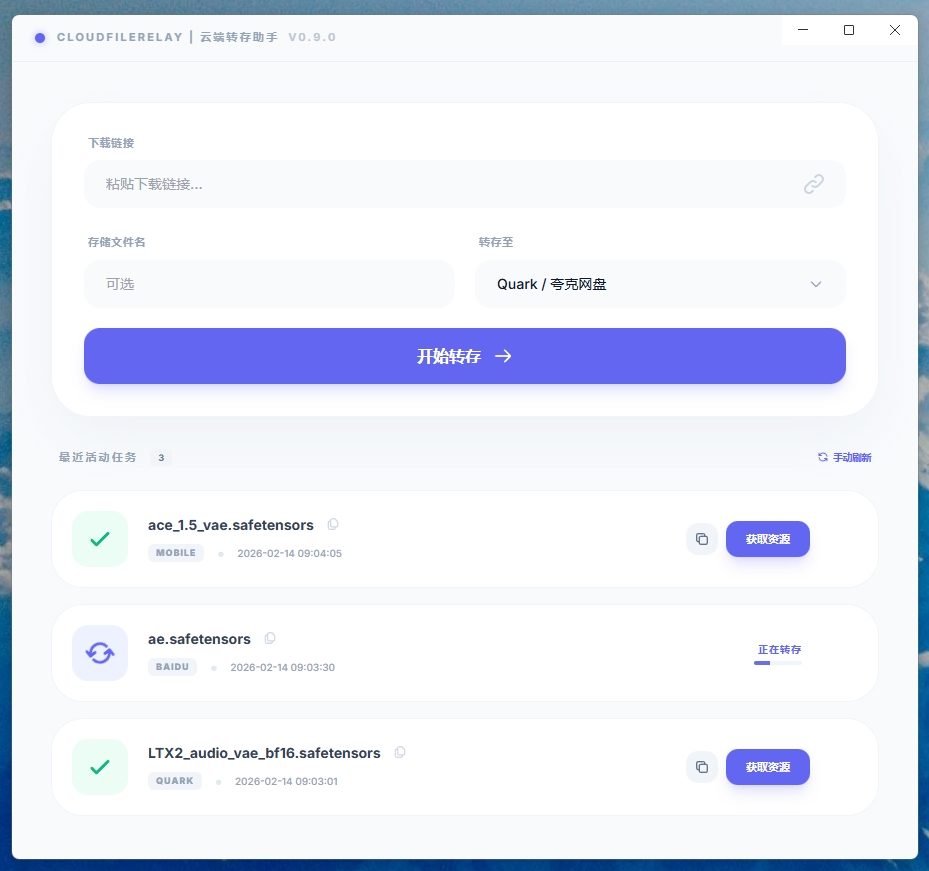

# CloudFileRelay - 云端转存助手

CloudFileRelay 是一款基于 Electron + Vite 开发的桌面端应用，旨在为开发者和 AI 爱好者提供便捷的云端文件转存与下载服务。



## 一、功能介绍

*   **便捷转存**：支持一键转存 GitHub 节点、Hugging Face 模型及数据集到网盘中。
*   **无需翻墙**：直接在云端完成资源下载，不消耗本地翻墙流量。
*   **支持秒传**：热门模型，热门资源支持秒传。
*   **离线转存**：任务发起后，无需开机等待，自动完成离线转存。
*   **进度提示**：实时转存进度提示。
*   **自动重试**：网络异常等原因，导致转存失败时，会自动重试。  
*   **超大文件**：支持单文件最大将近 **50GB** 的文件转存。
*   **支持网盘**：
    *   **夸克网盘**：会员大空间，满速传输。
    *   **百度网盘**：会员大空间，满速传输。
    *   **移动网盘**：CMCC中国移动网盘，单文件限制4G内，优点是不开会员也不限速。

## 二、使用说明

### 1. 下载ComfyUI节点
*   复制 GitHub 仓库链接并粘贴到应用中即可开始转存，自动打包节点为压缩包后进行转存。

### 2. 下载 Hugging Face 模型
*   **单个模型**：复制具体模型文件的下载链接进行转存。
*   **整个仓库**：直接复制模型仓库首页地址，应用将自动打包并转存整个仓库。总大小目前仅限50G内。

### 3. 下载 Hugging Face 数据集
*   直接复制数据集仓库首页地址，应用会自动将其打包成压缩包并完成转存。

### 4. 下载 Civitai (C站) 模型和Lora
1.  在浏览器中点击下载具体模型，开始下载任务。
2.  进入浏览器的下载列表，取消该下载任务。
3.  在下载列表中复制“实际下载地址”。
4.  将该实际下载地址链接粘贴到输入框中进行转存即可。

### 5. >>注意<<
请输入海外资源链接原始下载地址，由于转存服务器均在海外，所以最好不要输入国内镜像地址，否则转存速度不快。

## 三、安装包下载

- **支持 Windows**
  - [CloudFileRelay-Setup-0.9.9.exe](https://github.com/xuhongming251/CloudFileRelay/releases/download/v0.9.9/CloudFileRelay-Setup-0.9.9.exe)

- **支持 Mac**
  - [CloudFileRelay-0.9.9-arm64.dmg](https://github.com/xuhongming251/CloudFileRelay/releases/download/v0.9.9/CloudFileRelay-Setup-0.9.9.dmg)

- **版本历史**
  - [GitHub Releases](https://github.com/xuhongming251/CloudFileRelay/releases)


## 四、开发说明

### 1. 下载代码
```bash
git clone https://github.com/xuhongming251/CloudFileRelay.git
cd CloudFileRelay
```

### 2. 安装依赖
```bash
npm install
```

### 3. 启动开发模式
```bash
npm run dev
```

### 4. 打包应用
```bash
# 打包全平台
npm run build

# 仅打包 Windows 版本
npm run build:win

# 仅打包 Mac 版本
npm run build:mac
```

